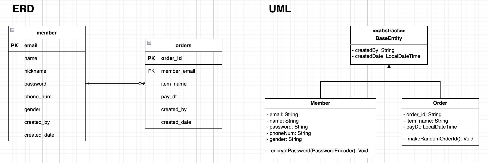

# idus Homework
회원과 주문 도메인을 활용하여 회원가입, 로그인, 주문 조회현 등의 기능 구현

### 테이블 및 클래스 구조

### Swagger 연결
- build.gradle 파일에 의존성 추가
- config 파일 작성
- http://localhost:8080/swagger-ui.html 접속

### SpringSecurity + jwt
- SpringSecurity - https://developerbee.tistory.com/200
- jwt - https://developerbee.tistory.com/201

### 기타
(+) swagger에서 테스트를 원활하게 하기 위해 주문하기 기능 추가     

(-) login 시 JWT를 사용하였지만 별도의 저장공간(Redis 등)에 저장하지 않아 서버 상에서 로그아웃 처리 불가능 (Request Mapping만 생성해둔 상태)